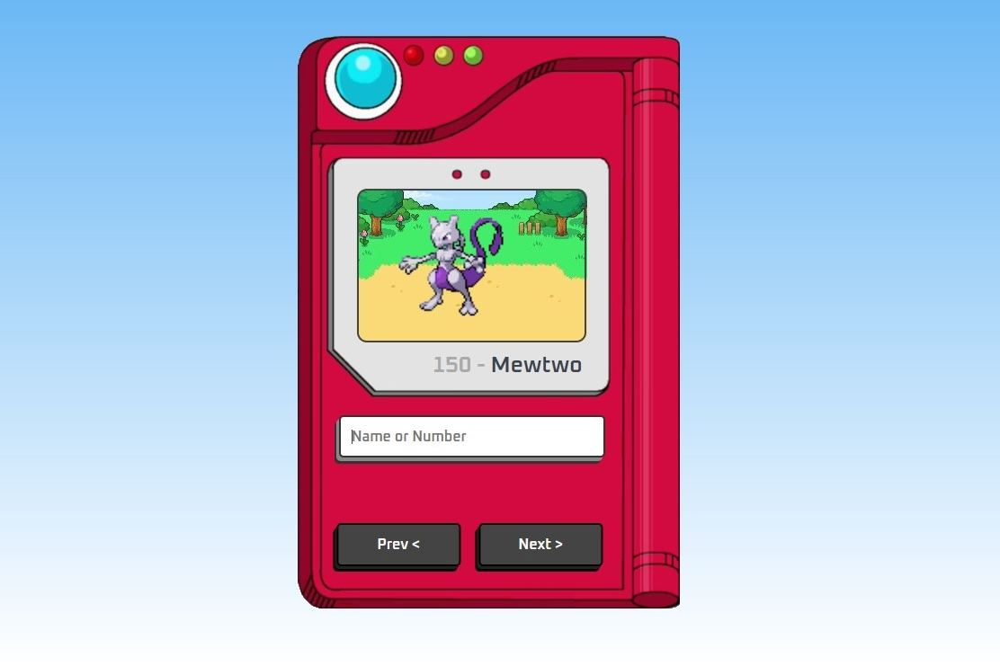
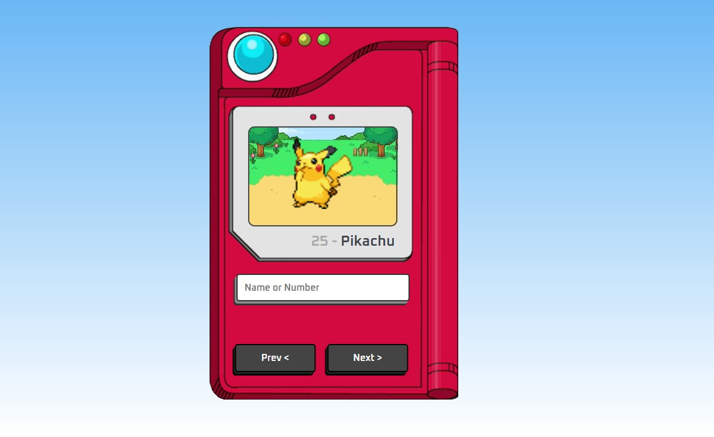

<b><i><u>'Pokédex'.</b></i></u> Todos os pokemons em gifs, utilizando PokeAPI.  

Projeto construído seguindo as dicas do <b>Manual do Dev </b> [YouTube](https://youtu.be/SjtdH3dWLa8)

## 🌐 Tecnologias

  

 

 

## 📱 Contato

